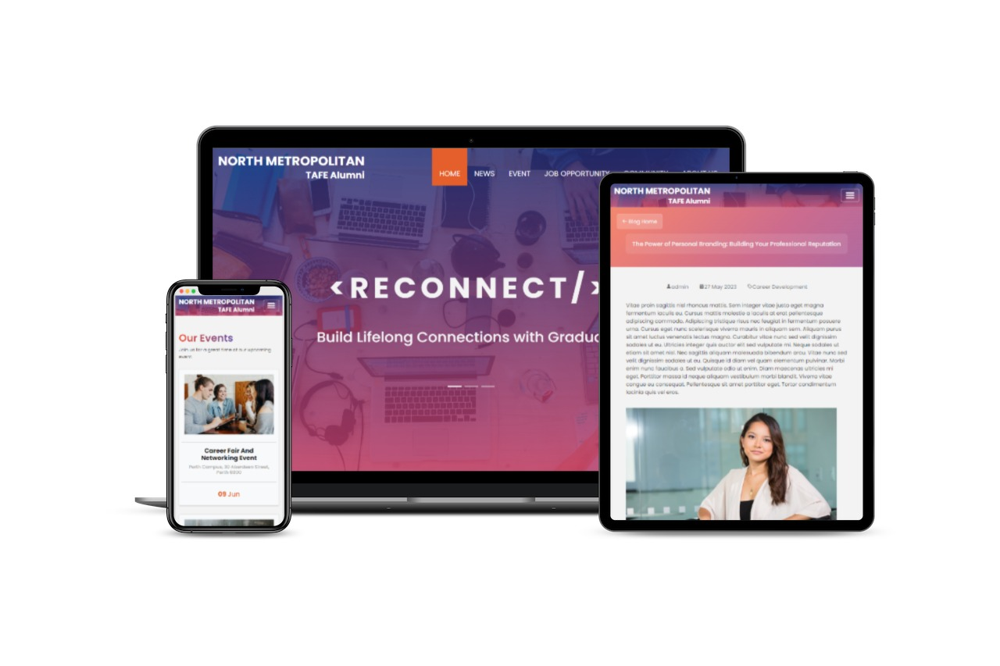

# [Grad Show Project] 2023 TAFE Alumni Website

Welcome to the Grad Show Alumni Website repository! This project is an exciting real-life client project that aims to create a fully functional and dynamic website for school alumni from scratch. The goal is to provide a platform for alumni to connect, engage, and stay updated with the latest happenings in their alma mater community. The website will be powered by a robust CMS backend, allowing client admins to effortlessly manage various types of content, including blogs, events, and job opportunities. Additionally, the platform will feature a dedicated forum for alumni to foster communication and collaboration. 

## Key Experiences Gained

Working solo on this project has provided me with invaluable hands-on experience in various aspects of web development:

- **Understanding and Capturing Client's Requirements:** Collaborated with the client closely, understand their vision and requirements for the alumni website, and ensure their needs were effectively translated into the final product.

- **Client Meetings and Communication:** Scheduled and conducted the most of meetings with the client to discuss project progress, gather feedback, and address any concerns or questions they had along the way. This experience has strengthened my communication and client management skills.

- **UI/UX Design:** Took charge of designing the user interface and user experience of the website, ensuring it aligns with the client's needs and provides an intuitive and visually appealing experience for alumni users.

- **Wireframing and Prototyping:** Created detailed wireframes and developed a static prototype of the website to showcase the layout, navigation flow, and overall functionality. This allowed the client to visualize the end product and provide early feedback.

- **WordPress Integration:** Finalized the integration of the website with WordPress, leveraging it as a powerful content management system. This involved developing a custom WordPress theme that seamlessly integrates with the design and functionality of the alumni website.

## Tech Stack

- **Front-end:** HTML, CSS, JavaScript, Bootstrap, SASS
- **Back-end:** PHP
- **CMS Platform:** WordPress

## Screenshot

## Getting Started

To run the Grad Show Alumni Website locally on your machine, follow these steps:

1. Clone this repository to your local machine.
2. Set up a local web server environment (e.g., using XAMPP or WAMP).
3. Import the provided database dump (tafealumni2023.WordPress.2023-06.xml).
4. Update the database connection details in the configuration files.
5. Launch the website in your preferred web browser.

## Conclusion

The Grad Show Alumni Website project has been an exciting opportunity to apply my web development skills and gain hands-on experience in building a dynamic website from scratch. Throughout this project, I have honed my skills in understanding client requirements, conducting meetings, UI/UX design, wireframing, prototyping, and WordPress integration. This project has equipped me with the necessary expertise to create impactful web solutions for real-life clients and further enhance my career as a web developer.

If you have any questions or need further assistance with this project, please don't hesitate to reach out. Happy coding! 🚀🌐💻